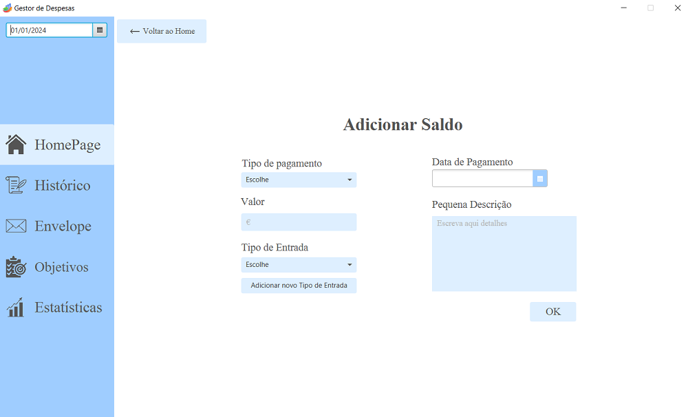
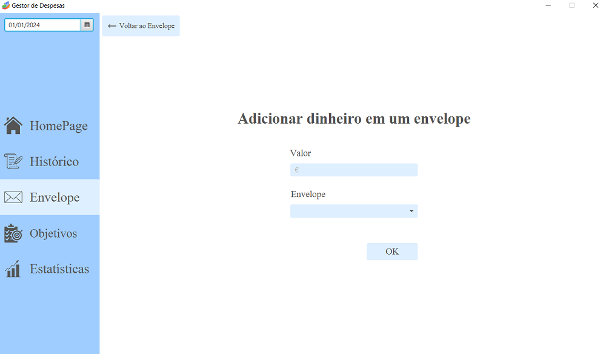
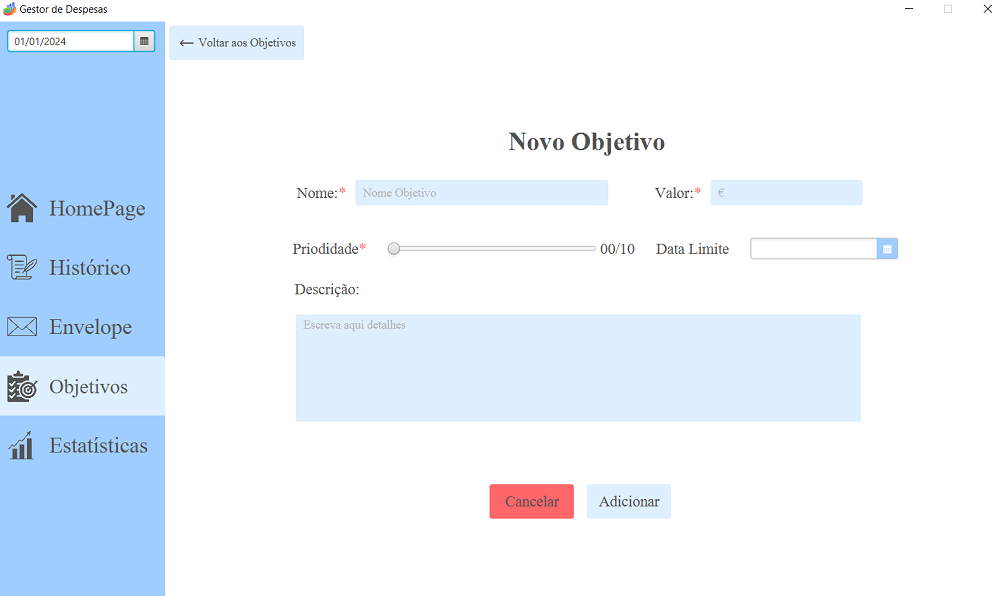

# Gestor de despesas

## Contents

- [Team](#team)
- [Vision and Scope](#vision-and-scope)
- [Requirements](#requirements)
    - [Use case diagram](#use-case-diagram)
    - [Mockups](#mockups)
    - [User stories](#user-stories)
- [Definition of Done](#definition-of-done)
- [Architecture and Design](#architecture-and-design)
    - [Domain Model](#domain-model)
- [Risk Plan](#risk-plan)
- [Pre-Game](#pre-game)
- [Release Plan](#release-plan)
  - [Release 1](#release-1)
  - [Release 2](#release-2)
- [Increments](#increments)
  - [Sprint 1](#sprint-1)
  - [Sprint 2](#sprint-2)
  - [Sprint 3](#sprint-3)

## Team

- Francisco Costa - 2021146317 - a2021146317@isec.pt
- Artur Yurchuk - 2021130221 - a2021130221@isec.pt
- Lara Bizarro - 2021130066 - a2021130066@isec.pt
- Joana Ferrao - 2020131638 - a2020131638@isec.pt
- Ana Sofia Silva - 2021154586 - a2021154586@isec.pt

***

## Vision and Scope

#### Problem Statement

##### Project background

Currently, the only way to control expenses is through bank statements, which becomes a tedious and complex job.
For a student that started recently having their own expenses (rent ,university fees) and revenues (monthly allowances or salaries) can be hard to manage them in order to reach to the end of the month with some money left.

##### Stakeholders

###### Students
People who want to keep a detailed record of their expenses for better financial management. These expenses are distributed between living costs, personal expenses and additional one-off costs.
###### Parents
They may provide financial support to students and have an indirect interest in the efficiency of the software. It is in their interest that their financial contributions are used responsibly and that their child has financial stability and education.

###### Educational Institutions
Although they may not have a direct financial interest, they do have an interest in the general well-being of their students - it is an issue that can affect their academic performance and overall experience at the institution.
There are also some institutions that offer scholarships to certain students, according to their performance or contribution to it.

#### Users
Students.

***

#### Vision & Scope of the Solution

##### Vision statement

We see Expense Manager as a catalyst for change, helping users take control of their money by having expenses summaries, analyses and tracking, alowing to establish monthly budgets/limits.

##### List of features

Our main objectives are the following:

- Track expenses both card and physical money
- Categorize expenses (For example: Canteen meals, tuition fees, going out, expenses, etc.)
- Expense summary
- Expense analysis
- Establish budgets/limits mothly (reserve or not allow the user to spend more)
- Notify the user when limits are close to being exceeded

##### Features that will not be developed
Link a card and bank account- Since it requires permissions that we do not have (we intend to resolve this issue by creating a budget that is entered by the user and adds the same amount each month. It will require the user to take care to record all financial operations carried out.)

##### Assumptions

It is assumed:
- Students actively use the software to track expenses, set budgets, and work toward their goals.
- Users will provide accurate values such as income and expenses.
- The demand for a financial product dedicated to the needs of students.
- The software infrastructure will be secure and resistant to data breaches.
- The software will comply with all relevant financial regulations and laws.
- The software assumes the need for continuous updates and improvements to adapt to changes in the financial scenario and user needs.

***

## Requirements

### Use Case Diagram

***

### Mockups

 Image 1: Homepage

 Image 2: Add entrada (US1)

 Image 3: Add budget/money (US7?,US13)

 Image 4: Add To pay task

 Image 5: History (Expenses and payments) (US10,US12,US3)

 Image 6: Budget homepage (US2)

 Image 7: Manage budget (US2)

 Image 8: Reserve amounts (US5)

 Image 9: Objective Homepage (US6)

 Image 10: Add Objective (US6)

 Image 11: Manage Objective (US6)

 Image 12: Statistic(US4,US8)

 
 Image 13: Reset Budget (US9)

 Image 14: View Academic Scholarship (US11)

 Image 15: Reports (US4,US8)

***

### User Stories

- User story 1 (tp-gps-11/gps_g11#2)
- User story 2 (tp-gps-11/gps_g11#3)
- User story 3 (tp-gps-11/gps_g11#7)
- User story 4 (tp-gps-11/gps_g11#8)
- User story 5 (tp-gps-11/gps_g11#9)
- User story 6 (tp-gps-11/gps_g11#10)
- User story 7 (tp-gps-11/gps_g11#11)
- User story 8 (tp-gps-11/gps_g11#12)
- User story 9 (tp-gps-11/gps_g11#13)
- User story 10 (tp-gps-11/gps_g11#14)
- User story 11 (tp-gps-11/gps_g11#15)
- User story 12 (tp-gps-11/gps_g11#16)
- User story 13 (tp-gps-11/gps_g11#17)

***
##### User Story 1
As a student, I want to be able to track my daily expenses,so that I can maintain an accurate record of my personal finances.
***
##### User Story 2
As a user, I want to manage categories so that I can organize my expenses according to different types.
***
##### User Story 3
As a student, I want to access expenses so that I can view all my recorded expenses.
***
##### User Story 4
As a student, I want to generate reports so that I can analyze send them or analize them later.
***
##### User Story 5
As a user, I want to reserve amounts for future expenses so that I can plan my budget.
***
##### User Story 6
As a user, I want to set goals so that I can work for a specific objective.
***
##### User Story 7
As a user, I want to see the monthly budget so that I can make adjustments as needed.
***
##### User Story 8
As a user, I want to extract data from reports in PDF and Excel, so that I can share and analyze my expenses.
***
##### User Story 9
As a student, I want to reset the monthly budget, which is the amount of money I have available per month, so that I can start a new period of financial control.
***
##### User Story 10
As a student, I want to view the transaction history so that I can review my past financial activities.
***
##### User Story 11
As a student, I want to view the use of my academic scholarship so that I can keep track of the scholarship usage and decide on the best way to manage it.
***
##### User Story 12
As a user, I want to view expenses by categoria, so that I can understand in which categories I spend the most money.
***
##### User Story 13
As a working student, I want to add money to my budget, so that I can keep the budget updated.
***

## Definition of done

(This section is already written, do not edit)
It is a collection of criteria that must be completed for a User Story to be considered “done.”

1. All tasks done:
  - CI – built, tested (Junit), reviewed (SonarCloud)
  - Merge request to qa (code review)
2. Acceptance tests passed
3. Accepted by the client
4. Code merged to main

***

## Architecture and Design

#### Domain Model

***

## Risk Plan

##### Threshold of Success
By the end of the second realease we must have all the user stories with "must" priorities.

##### Risk List

- RSK1 – PxI: 4x5=20; The team doesn't have any experience in this type of project, this can lead to delays in goals due to poorly calculated time estimates or communication failures.
- RSK2 – PxI: 3x4=12; There are constant simultaneous changes to the project, this can cause conflicts,complications or delays on the project. 
- RSK3 – PxI: 4x2=8; Taking into account that the group members are not professionals in this area, they may write code that uses excessive resources and encounter more bugs. This will force us to spend more time than necessary, leading to possible delays.

##### Mitigation Actions (threats>=20)
- RSK1 - AS; Perform regular check-ins twice a week during sprints and meetings;

***

## Pre-Game
### Sprint 0 Plan

- Goal: Plan the project, create an action plan and present the project to the client

- Dates: from 13/Oct to 27/Oct, 2 weeks

- Roles:
  - Product Owner: Francisco Costa
  - Scrum Master: Artur Yurchuck
  - Developer: Lara Bizarro, 
  	           Joana Ferrao, 
  	           Ana Sofia Silva.

- Sprint 0 Backlog (don't edit this list):
  - Task1 – Write Team
  - Task2 – Write V&S
  - Task3 – Write Requirements
  - Task4 – Write DoD
  - Task5 – Write Architecture&Design
  - Task6 – Write Risk Plan
  - Task7 – Write Pre-Gane
  - Task8 – Write Release Plan
  - Task9 – Write Product Increments
  - Task10 – Create Product Board
  - Task11 – Create Sprint 0 Board
  - Task12 – Write US in PB, estimate (SML), prioritize (MoSCoW), sort
  - Task13 – Create repository with “GPS Git” Workflow
  - Task14 - Fix week 4 feedback problems
  - Task15 - Create wiki page with weekly feedback
  - Task16 - Create wiki page with meeting agenda
  - Task17 - Plan sprint 1

  ***

## Release Plan

### Release 1

- Goal: MVP -> 
    - Track, Categorize and Analise expenses; 
    - Expense Summary;
    - Allow the criation of limits/budgets, in certain areas;
- Dates:[teams1] 30/Nov
- Release: V1.0

***

### Release 2

- Goal: Final release - Have a functional app with the missing features (Notifications).
- Date: [teams 0+1] 15/Dec
- Release: V2.0

***

## Increments

### Sprint 1
##### Sprint Plan

- Goal: User Interface that allows you to get an ideia of the inicial project, only with the simplest of methods as creation of new acounts, tracking and managing expenses, monthly budget and adding and categorize expenses.

- Roles:
  - Product Owner: Lara Bizarro
  - Scrum Master: Joana Ferrão

- Dates: from 27/Oct to 17/Nov, 3 weeks

- To do (order by importance):

  - US 7: As a user, I want to create the monthly budget so that I can make adjustments as needed. [Story Points: L]
    - Task 1: Design user interface to allow budget entry
    - Task 2: Add budget methods
    - Task 3: Create budget validation methods
    - Task 4: Create Unit tests and fix remaining bugs

  - US 13: As a working student, I want to add money to my budget, so that I can keep the budget updated [Story Points: L]
    - Task 1: Design user interface 
    - Task 2: Add budget adding methods
    - Task 3: Create budget validation methods
    - Task 4: Create Unit tests and fix remaining bugs
    
  - US 1: As a student, I want to be able to track my daily expenses,so that I can maintain an accurate record of my personal finances.[Story Points: L]
    - Task 1: Design user interface to allow entrada entry
    - Task 2: Add expenses managing methods
    - Task 3: Create expenses validation methods
    - Task 4: Create a display of the entrada
    - Task 5: Create Unit tests and fix remaining bugs

  - US 2: As a user, I want to manage categories so that I can organize my expenses according to different types.[Story Points: L]
    - Task 1: Design user interface to allow categoria management
    - Task 2: Add categoria managing methods
    - Task 3: Create categoria validation methods
    - Task 4: Create Unit tests and fix remaining bugs 

  - US 10: As a student, I want to view the transaction history so that I can review my past financial activities. [Story Points: M]
    - Task 1: Design user interface to show trasaction history
    - Task 2: Create methods to view trasaction history
  
  
- Story Points: 4L + 1M

##### Sprint Review

- Analysis: All requirements were met (us 7,13,1,2,10). However, there was a disagreement regarding the budget, as it did not correspond to the client's idealization.

- Story Points: 4L+ 1M

- Version: 0.1 

- Client analysis: "Todas as tarefas feitas. Objetivo: despesas, entradas, categorias, histórico de despesas. Houve entendimento errado sobre orçamento. Está tudo feito de acordo com a sprint.A pipeline não está a funcionar "

- Conclusions:For the next sprint we'll have to adapt the tasks we have planned, as we will have to correct the budget according to the client's vision.

##### Sprint Retrospective

- What we did well:
    - Manage to work within the time estimated (tasks have all been completed).
    - Communication between members was effective.
    - Good project base that allows you to get an ideia of the inicial project, tracking and managing expenses and categorize expenses.

- What we did less well:
    - Misunderstanding with tracking and managing monthly budget.
    - Only carried out unit tests after all tasks were completed,.

- How to improve to the next sprint:
    - We should comunicate more with the client so by the end of the sprint we are on the same page as them, this will save the time of correcting the design and functionalities of our software.
    - We should do unit test after each task developed (according to the need), so as not to run the risk of coding on fallible code

***

#### Sprint 2

##### Sprint Plan

- Goal: Monthly budget reseting, entrada display, transaction history display, allow goal setting and amount reservation, and manage scholarship.

- Roles:
  - Product Owner: Ana Sofia Silva
  - Scrum Master: Francisco Costa

- Dates: from 17/Nov to 1/Dez, 2 weeks

- To do:

  - US7 and US13 (from last sprint, budget)[Story Points:S]
    - Task 1: Corrections regarding budget

  - US 9: As a student, I want to reset the monthly budget, which is the amount of money I have available per month, so that I can start a new period of financial control. [Story Points: S]
    - Task 1: Create feature to allow budget reset
    - Task 2: Create budget reseting methods
    
  - US 12: As a user, I want to view expenses by categoria, so that I can understand in which categories I spend the most money. [Story Points: L]
    - Task 1: Design interface to allow viewing of expenses grouped by categoria  
    - Task 2: Create methods to filter the expenses to a certain time period

  - US 5: As a user, I want to reserve amounts for future expenses so that I can plan my budget. [Story Points: M]
    - Task 1: Design user interface to allow amount reservation
    - Task 2: Add reservation methods 
    - Task 3: Create methods to subtract the amount reserved for a certain categoria from future expenses

  - US 3: As a student, I want to access expenses so that I can view all my recorded expenses. [Story Points: M]
    - Task 1: Design user interface
    - Task 2: Create methods to filter expenses

  - US 11: As a student, I want to view the use of my academic scholarship so that I can keep track of the scholarship usage and decide on the best way to manage it. [Story Points: M]
    - Task 1: Create methods related the scholarship

  - US 6: As a user, I want to set goals so that I can work for a specific objective. [Story Points: M]
    - Task 1: Design user interface
    - Task 2: Implement methods to allow creation and editing of goals
    - Task 3: Create methods to allow goal organization 

- Story Points: 1L + 4M + 2S

- Analysis: short analysis of the planning meeting

##### Sprint Review

- Analysis: what was not done or what was added (Link to US or Task from the PB)

- Story Points: 2S+1M+2X+2H

- Version: 0.1 

- Client analysis: client feedback

- Conclusions: what to add/review

##### Sprint Retrospective

- What we did well:
    - A
- What we did less well:
    - B
- How to improve to the next sprint:
    - C

***

#### Sprint 3

##### Sprint Plan

- Goal: Notifications for goals or low funds, report generation and exportation to PDF

- Roles:
  - Product Owner: Artur Yurchuck
  - Scrum Master: Lara Bizarro
- Dates: from 1/Dez to 15/Dez, 2 weeks

- To do:

  - US 4: As a student, I want to generate reports so that I can analyze send them or analize them later. [Story Points: L]
    - Task 1: Implement feature to allow generation of a report
    - Task 2: Create methods to generate report

  - US 6: As a user, I want to set goals so that I can work for a specific objective. [Story Points: M]
    - Task 4: Create notifications methods

  - US 11: As a student, I want to view the use of my academic scholarship so that I can keep track of the scholarship usage and decide on the best way to manage it. [Story Points: M]
    - Task 2: Create methods to notify the user of low funds  

  - US 8: As a user, I want to extract data from reports in PDF and Excel, so that I can share and analyze my expenses. [Story Points: M]
    - Task 1: Create methods to generate and export reports in PDF and Excel formats
  
- Story Points: 1L + 3M

- Analysis: short analysis of the planning meeting

##### Sprint Review

- Analysis: what was not done or what was added (Link to US or Task from the PB)

- Story Points: 2S+1M+2X+2H

- Version: 0.1 

- Client analysis: client feedback

- Conclusions: what to add/review

##### Sprint Retrospective

- What we did well:
    - A
- What we did less well:
    - B
- How to improve to the next sprint:
    - C

***
