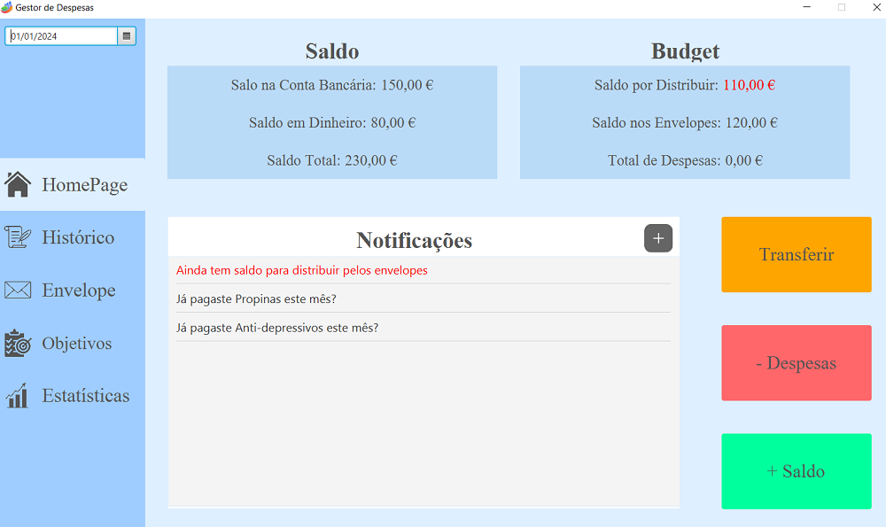
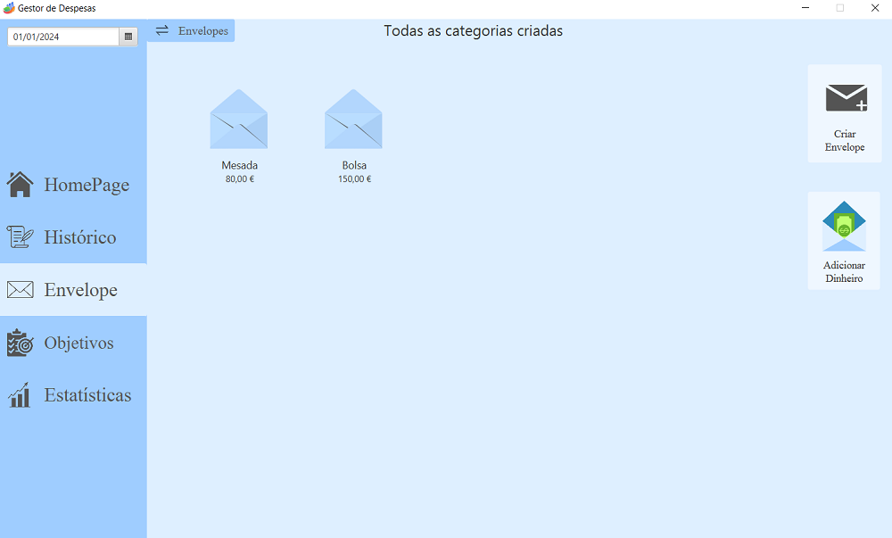

# Project Title

## Contents

- [Team](#team)
- [Vision and Scope](#vision-and-scope)
- [Requirements](#requirements)
    - [Use case diagram](#use-case-diagram)
    - [Mockups](#mockups)
    - [User stories](#user-stories)
- [Definition of Done](#definition-of-done)
- [Architecture and Design](#architecture-and-design)
    - [Domain Model](#domain-model)
- [Risk Plan](#risk-plan)
- [Pre-Game](#pre-game)
- [Release Plan](#release-plan)
  - [Release 1](#release-1)
  - [Release 2](#release-2)
- [Increments](#increments)
  - [Sprint 1](#sprint-1)
  - [Sprint 2](#sprint-2)
  - [Sprint 3](#sprint-3)

## Team

- Francisco Costa - 2021146317
- Artur Yurchuk - 2021130221
- Lara Bizarro - 2021130066
- Joana Ferrao - 2020131638
- Ana Sofia Silva - 2021154586

***

## Vision and Scope

#### Problem Statement

##### Project background

Currently, the only way to control expenses is through bank statements, which becomes a tedious and complex job.
In an attempt to make it easier to read financial expenses, we sought to develop an Expense Manager - an intuitive and easy-to-use solution - that
allows you to categorize and view a summary of expenses for the day, month or even the year.

##### Stakeholders

###### Stakeholder Primário - Estudante 
Students are the main beneficiaries of this software, as it directly affects their ability to manage their finances.

###### Interessados Secundários: Pais / Responsáveis
They may provide financial support to students and have an indirect interest in the efficiency of the software. It is in your interest that your financial contributions are used responsibly and that your child has financial stability and education.

###### Stakeholders Terceários - Instituições de Ensino 
Although they may not have a direct financial interest, they do have an interest in the general well-being of their students - it is an issue that can affect their academic performance and overall experience at the institution.
There are also some institutions that offer scholarships to certain students, according to their performance or contribution to it.

##### Users
Students(People who want to keep a detailed record of their expenses for better financial management. These expenses are distributed between living costs, personal expenses and additional one-off costs).

***

#### Vision & Scope of the Solution

##### Vision statement

We see Expense Manager as a catalyst for change, helping users take control of their money, reducing financial stress and helping to create and meet user-imposed goals.

##### List of features

Our main objectives are the following:

- Track expenses
- Categorize expenses (For example: Canteen meals, tuition fees, going out, expenses, etc.)
- Expense summary
- Expense analysis
- Establish budgets/limits in certain areas (reserve or not allow the user to spend more)
- Notify the user when limits are close to being exceeded

##### Features that will not be developed
##### Associar um cartão e uma conta bancária
Since it requires permissions that we do not have (we intend to resolve this issue by creating a budget that is entered by the user and adds the same amount each month. It will require the user to take care to record all financial operations carried out.)

##### Assumptions

It is assumed:
- Students actively use the software to track expenses, set budgets, and work toward their goals.
- Users will provide accurate values such as income and expenses.
- The demand for a financial product dedicated to the needs of students.
- The software infrastructure will be secure and resistant to data breaches.
- The software will comply with all relevant financial regulations and laws.
- The software assumes the need for continuous updates and improvements to adapt to changes in the financial scenario and user needs.

***

## Requirements

### Use Case Diagram

***

### Mockups

***

### User Stories

- User story 1 (link to issue card)
- User story 2 (link to issue card)
- User story 3 (link to issue card)

***

## Definition of done

(This section is already written, do not edit)
It is a collection of criteria that must be completed for a User Story to be considered “done.”

1. All tasks done:
  - CI – built, tested (Junit), reviewed (SonarCloud)
  - Merge request to qa (code review)
2. Acceptance tests passed
3. Accepted by the client
4. Code merged to main

***

##### User Story 1

As a new user, I want to be able to create a new account, So that I can start using it and mange my finances effectively.

Story Points - 2S.
Priorities  - Must have (M).

###### Acceptance Criteria

- When I open the software, I should see a clear and intuitive option to log in or register a new account.
- During the registration process, I must be asked for my name, email address and create a secure password with verification.
- After providing the required information, I should receive a verification email to confirm my account.
- After clicking the verification link in the email, I should receive a confirmation message in the software indicating that my account is active.
- I should not be able to access the software features until my account is verified.
- If I encounter any problems during login, such as an invalid email or password, I should receive clear error messages guiding me on how to reset the password.

***

##### User Story 2

As a student, I want to be able to track my daily expenses,so that I can maintain an accurate record of my personal finances.

Story Points -.
Priorities  - .

###### Acceptance Criteria

- After logging in, I should have an initial panel.
- Furthermore, the software must have a very visible entry to enter my expenses.
- I should be able to enter the amount spent, the date, a optional description and choose an existing category (e.g. food, canteen meals, tuition fees, transport, gym) or create a new one. 
- The system must validate if the mandatory fields are filled in correctly.
- After entry, expenses should be recorded and displayed in a list or panel in the application.
- It should be possible to edit or delete previously entered expenses.

***

##### User Story 3

As a user, I want to manage categories so that I can organize my expenses according to different types.

Story Points -.
Priorities  - .

###### Acceptance Criteria

- There should be a section in the application dedicated to category management.
- The user should be able to create and delete categories.
- The created categories should be applicable to the expenses entered in User Story 2.
- It should be possible to assign a category to each expense during entry.

***

##### User Story 4

As a student, I want to access expenses so that I can view all my recorded expenses.

Story Points -.
Priorities  - .

###### Acceptance Criteria

- There should be a page or panel where I can view all recorded expenses.
- Expenses should be displayed in a list or table, showing details such as date, amount, category, and description (if available).
- I should be able to filter expenses by date, category, or amount.

***

##### User Story 5

As a student, I want to generate reports so that I can analyze send them or analize them later.

Story Points -
Priorities  - 

###### Acceptance Criteria

- There should be a report feature.
- I should be able to select a specific time period for the report.
- The report should include information on total spending, spending by category, and other relevant statistics.
- I should be able to view and export the report in common formats, such as PDF or CSV.

***

##### User Story 6

As a user, I want to reserve amounts for future expenses so that I can plan my budget.

Story Points -
Priorities  - 

###### Acceptance Criteria

- There should be a feature to reserve amounts for future expenses in the application.
- I should be able to create specific reservations for expense categories.
- The system should track the reserved amount and automatically subtract it from future expenses in that category.

***

##### User Story 7

As a user, I want to set budgets for specific expense categories so that I can control my spending.

Story Points -
Priorities  - 

###### Acceptance Criteria

- There should be a feature to set budgets for categories in the application.
- I should be able to define a maximum budget for each category.
- The system should provide notifications or alerts when the budget is close to being exceeded.

***

##### User Story 8

As a user, I want to update the monthly budget so that I can make adjustments as needed.

Story Points -
Priorities  - 

###### Acceptance Criteria

- There should be a feature to update budget in the application.
- I should be able to change the budget amount for each month.
- The system should reflect the budget updates in the application's statistics and alerts.

***

## Architecture and Design

#### Domain Model

***

## Risk Plan

##### Threshhold of Success
For the project to be considered "successful" we must have:
  - Expense Tracking
  - categorization, summary and analysis of expenses
  - Allows you to establish budgets/limits in certain areas

##### Risk List

###### RSK1 Falta de Experiencia
RSK1 – PxI: 4x5=20; All team members are making the chair for the first time - none have experience in this type of project.
This can lead to delays in goals due to poorly calculated time estimates or communication failures.

###### RSK2 Alterações constantes e conflitos
RSK2 – PxI: 3x4=12; All projects undergo changes throughout their development.
Constant changes to the project can cause complications or delays, mainly due to conflicts that may arise with each new change prepared simultaneously by the various team members.

###### RSK3 Bugs e uso excessivo de recursos
RSK3 – PxI: 4x=8; There is a high probability that the project has bugs; Taking into account that the group members are not professionals in the area of programming, they may write code that uses excessive resources of the machine where the program will be executed.
Bugs that occur during the project will force us to spend more time than necessary, leading to possible delays. Excessive use of resources will have this same effect due to last minute changes aimed at reducing their use.

###### RSK4 Segurança e privacidade
RSK4 - PxI: 4x5=20; The group's members are inexperienced in the area of security and privacy.
As we intend to work with sensitive information, we have a high risk of data or privacy breaches, which could jeopardize the fidelity of our software. Therefore, the implementation of strict security protocols, cryptology and compliance with data protection laws are essential.

###### RSK5 Marketing
RSK5 - PxI: 5x5=25; The software will be useless if it is not used.
Another risk will be student adoption, in other words, the lack of knowledge about the software, as there are many financial applications. It is essential to form partnerships with institutions and adopt effective marketing measures.

##### Mitigation Actions (threats>=20)
- RSK1 - AS; Perform regular check-ins during sprints and meetings;
- RSK2 - AS; Pan the project well to avoid any future changes;
- RSK3 - AS; Communicate with group members, so that they help keep the code consistent and bug-free;
- RSK4 - CP; Hold meetings every week to check the progress of all members;
- RSK5 - MS; Efficiently manage time among all members, in order to implement as many features as possible.

***

## Pre-Game
### Sprint 0 Plan

- Goal: Plan the project, create an action plan and present the project to the client

- Dates: from 10-13/Oct to 24-27/Oct, 2 weeks

- Roles:
  - Product Owner: Francisco Costa
  - Scrum Master: Artur Yurchuck
  - Developer: Lara Bizzarro
  	           Joana Ferrao
  	           Ana Sofia Silva
  
- Story Points: 2S+3M+3X
- Prioritize: MSC

- Sprint 0 Backlog (don't edit this list):
  - Task1 – Write Team
  - Task2 – Write V&S
  - Task3 – Write Requirements
  - Task4 – Write DoD
  - Task5 – Write Architecture&Design
  - Task6 – Write Risk Plan
  - Task7 – Write Pre-Gane
  - Task8 – Write Release Plan
  - Task9 – Write Product Increments
  - Task10 – Create Product Board
  - Task11 – Create Sprint 0 Board
  - Task12 – Write US in PB, estimate (SML), prioritize (MoSCoW), sort
  - Task13 – Create repository with “GPS Git” Workflow

***

## Release Plan

### Release 1

- Goal: MVP - description -- Acompanhamento,categorização, resumo e análise de despesas, permitir estabelecer budgets/limites em certas áreas
- Dates: [teams 0] 21-24/Nov | [teams1] 28-30/Nov
- Release: V1.0

***

### Release 2

- Goal: Final release – description​
- Date: [teams 0+1] 12-15/Dec
- Release: V2.0

***

## Increments

### Sprint 1
##### Sprint Plan

- Goal: User Interface que permita ter um ideia inicial do projeto, com os metodos mais simples
- Roles:
  - Product Owner: name
  - Scrum Master: name
- Dates: from 24-27/Oct to 7-10/Nov | 14-17/Nov, 2 | 3 weeks

- Roles:
  - Product Owner: name
  - Scrum Master: name

- To do:
  - (list of US or Tasks from the PB)
  - US1: As … I want … so that …
  - Task1: Some task
  
- Story Points: 2S+3M+3X+2H

- Analysis: short analysis of the planning meeting

##### Sprint Review

- Analysis: what was not done or what was added (Link to US or Task from the PB)

- Story Points: 2S+1M+2X+2H

- Version: 0.1 

- Client analysis: client feedback

- Conclusions: what to add/review

##### Sprint Retrospective

- What we did well:
    - A
- What we did less well:
    - B
- How to improve to the next sprint:
    - C

***

#### Sprint 2

##### Sprint Plan

- Goal: Metodos mais complexos, melhorando e adicionando alguns aspetos de user interface 

- Roles:
  - Product Owner: name
  - Scrum Master: name
- Dates: from 24-27/Oct to 7-10/Nov | 14-17/Nov, 2 | 3 weeks

- Roles:
  - Product Owner: name
  - Scrum Master: name

- To do:
  - (list of US or Tasks from the PB)
  - US1: As … I want … so that …
  - Task1: Some task
  
- Story Points: 2S+3M+3X+2H

- Analysis: short analysis of the planning meeting

##### Sprint Review

- Analysis: what was not done or what was added (Link to US or Task from the PB)

- Story Points: 2S+1M+2X+2H

- Version: 0.1 

- Client analysis: client feedback

- Conclusions: what to add/review

##### Sprint Retrospective

- What we did well:
    - A
- What we did less well:
    - B
- How to improve to the next sprint:
    - C

***

#### Sprint 3

##### Sprint Plan

- Goal: User Interfeca aperfeiçoada, terminar todos os metodos em falta, e corrigir bugs que possam existir 

- Roles:
  - Product Owner: name
  - Scrum Master: name
- Dates: from 24-27/Oct to 7-10/Nov | 14-17/Nov, 2 | 3 weeks

- Roles:
  - Product Owner: name
  - Scrum Master: name

- To do:
  - (list of US or Tasks from the PB)
  - US1: As … I want … so that …
  - Task1: Some task
  
- Story Points: 2S+3M+3X+2H

- Analysis: short analysis of the planning meeting

##### Sprint Review

- Analysis: what was not done or what was added (Link to US or Task from the PB)

- Story Points: 2S+1M+2X+2H

- Version: 0.1 

- Client analysis: client feedback

- Conclusions: what to add/review

##### Sprint Retrospective

- What we did well:
    - A
- What we did less well:
    - B
- How to improve to the next sprint:
    - C

***
